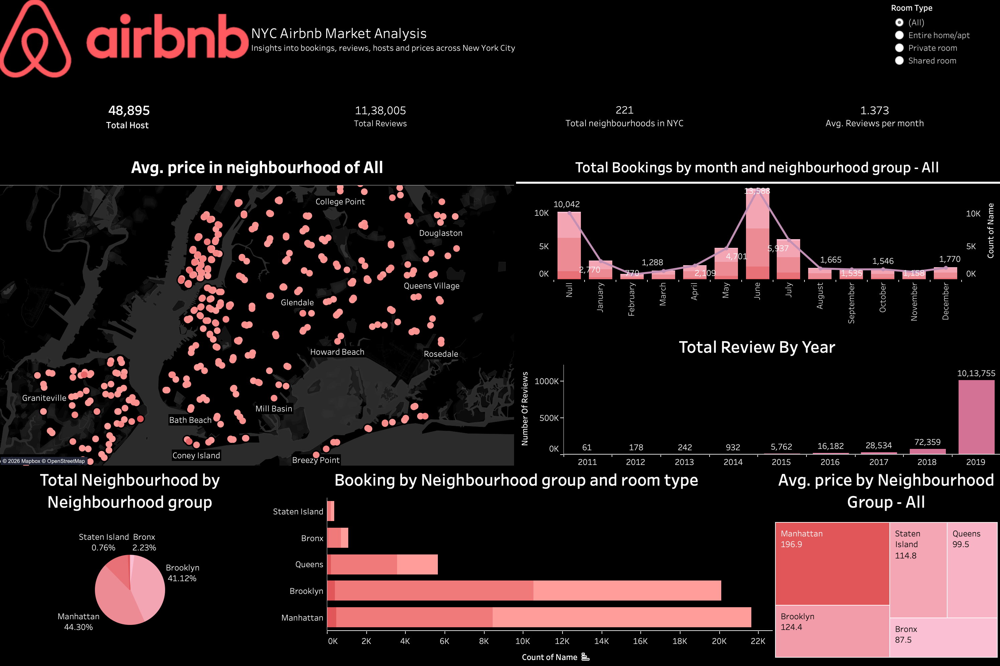

# NYC Airbnb Analysis Dashboard (2019)

A comprehensive data visualization project analyzing the New York City Airbnb market using **Tableau**. This dashboard transforms raw listing data into actionable insights regarding pricing, availability, and geographical distribution across the five boroughs.

## 📊 Live Dashboard
**[View the Interactive Dashboard on Tableau Public](https://public.tableau.com/app/profile/vikrant.yadav4874/viz/Air-BNB_17771340446380/Dashboard4)**

---

## 🖼️ Preview

*Example view of the NYC Airbnb Market analysis dashboard.*

---

## 📝 Project Overview
This project explores the 2019 NYC Airbnb dataset to identify trends that help both travelers and hosts. By visualizing nearly 49,000 listings, the dashboard answers key questions:
* Which boroughs are the most expensive for different room types?
* How does listing density vary across the city?
* What is the relationship between price, availability, and number of reviews?

## 🛠️ Tools & Technologies
* **Tableau Desktop/Public:** Used for data visualization and dashboard creation.
* **Dataset:** `AB_NYC_2019.csv` (New York City Airbnb Open Data).
* **Key Metrics:** Price, Minimum Nights, Number of Reviews, Availability, and Host Listing Counts.

---

## 📈 Key Insights
1. **Borough Comparison:** Manhattan has the highest density of listings and the highest average prices, followed closely by Brooklyn.
2. **Room Type Preferences:** "Entire home/apt" is the most common listing type, but "Private rooms" offer a significant budget-friendly alternative in boroughs like Queens and The Bronx.
3. **Availability Trends:** Analysis shows a correlation between high-availability listings and lower price points in certain outer-borough neighborhoods.
4. **Host Activity:** Identification of top hosts and their impact on the local market inventory.

---

## 📂 Repository Structure
* `Air-BNB.twbx`: The packaged Tableau workbook (open with Tableau Desktop or Reader).
* `AB_NYC_2019.csv`: The raw dataset used for the analysis.
* `dashboard.png`: Screenshot of the final dashboard.

---

## 🚀 How to Run Locally
1. Clone this repository:
   ```bash
   git clone [https://github.com/YOUR_USERNAME/YOUR_REPO_NAME.git](https://github.com/YOUR_USERNAME/YOUR_REPO_NAME.git)
